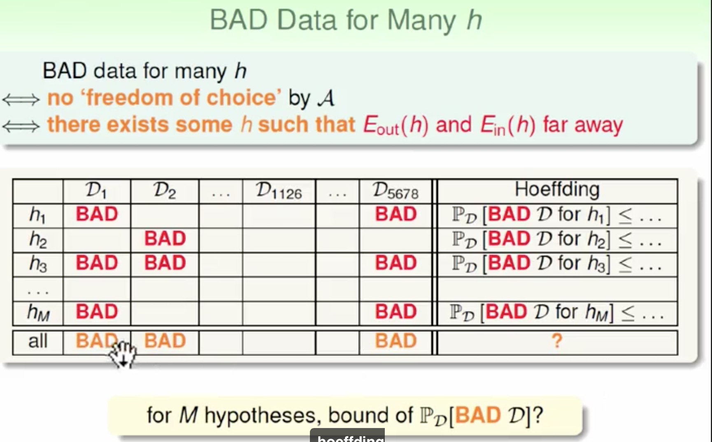
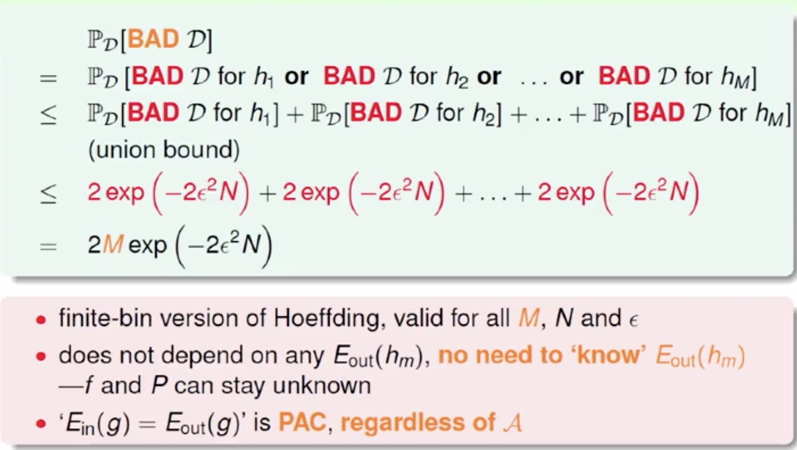

##Probability to Rescue

用抽样得到的频率u估计总体的频率v符合公式
#####Hoeffding's Inequality

$$P[|v-\mu|>\epsilon] \le 2e^{-2\epsilon N}$$

当N足够大得时候u与v很可能接近

##Connection to learning

把数据集D当作是抽样得到的数据，用hypothsis h(x)在数据集D上的结果与实际的结果对比（假设没有噪音，既是理想的f(x)在D上的结果)，将其相似性当作v,
$$E_{out}(h)=\epsilon_{x\in P}|h(x)\ne f(x)|（未知）$$
$$E_{in}(h)=1/N\sum_{n=1}^{N}|h(x_{n})\ne y_{n}|(已知)\\\\
所以利用上面的Hoeffding's Inequality就可以用数据集得到的E\_{in}(h)来估计E_{out}(h)$$
类似上面的结论有

**for any fixed h,in 'big' data (N large),in-sample err Ein(h) is probably closed to out-of-sample error Eout(h)(within epsilon)**

$$P[|E_{in}(h)-E_{out}(h)|>\epsilon]\le 2e^{-2\epsilon N}$$  
所以得到一个初步结论,对任意给定的h当数据集足够大得时候,  
$$E_{in}(h)\approx E_{out}(h)$$

进一步的如果Ein(h)很小，那么可以说明h(x)与f(x)是接近的。考虑到这个结论，我们可以用新的测试数据集来测试我们得到的h的效果如何

##Connection to Real Learning
  
连投五次硬币都是正面的概率是1/32，但是让一百五十个人都投五个，至少一个出现五次都朝上的概率超过了99%。  
BAD DATA for One h:Ein与Eout的差值很大  
BAD DATA for many h

所以当hypothesis set只有有限多种选择，而数据集的大小N足够大的时候，我们可以认为Ein与Eout是很有可能接近的。