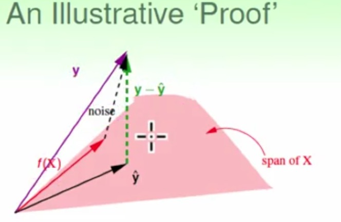

###Linear Regression Algorithm

#####公式
- $$E_{in}(w)=\frac{1}{N}\sum_{n=1}^{N}(w^Tx_{n}-y_{n})^2$$
- 矩阵化$$\min_{w}E_{in}(w)=\frac{1}{N}{||Xw-y||}^2$$
- $$w_{LIN}={(X^TX)}^{-1}X^Ty$$
- $$X^{+}\triangleq (X^TX)^{-1}X^T$$
- therefore $$w_{LIN}=X^{+}y$$

####Generalization issue
- $$\overset{-}{E}=\underset{D \tilde{} P^N}{\epsilon} \\{E_{in}(w_{LIN}w.r.t.D)\\}\overset{to \,be\, shown}{=} noise\,level*(1-\frac{d+1}{N})$$
- $$\begin{align} E_{in}(w_{LIN}) & =\frac{1}{N}{||y-\hat{y}||}^2=\frac{1}{N}{||y-XX^+y||}^2 \\\ & =\frac{1}{N}{||(I-XX^+)y||}^2 \end{align}$$
- call $XX^+$ the hat matrix H because it puts ^ on y 
- 
- $$\begin{align} E_{in}(W_{LIN})=\frac{1}{N}{||y-\hat{y}||}^2 & =\frac{1}{N}{||(I-H)noise||}^2 \\\ &=\frac{1}{N}(N-(d+1)){||noise||}^2 \end{align}$$ 
- $$\overline{E_{in}}=noise\, level*(1-\frac{d+1}{N})$$
- 实际上$\overline{E_{out}}=noise\, level*(1+\frac{d+1}{N})$(算起来比较复杂)
- 所以平均来说$E_{out}-E_{in}\approx \frac{2(d+1)}{N}$
- 考虑到Linear classification(0/1分类)的误差函数$err_{0/1}=[sign(W^Tx)\ne y]$与Linear Regression的误差函数$err_{sir}={(W^Tx-y)}^2$$$存在关系$$$err_{0/1}\le err_{sir}$所以可以用Linear Regression得到的$W_{LIN}$来作预测($sign({W_{LIN}}^Tx)$)也可以拿来做pocket函数的初始W